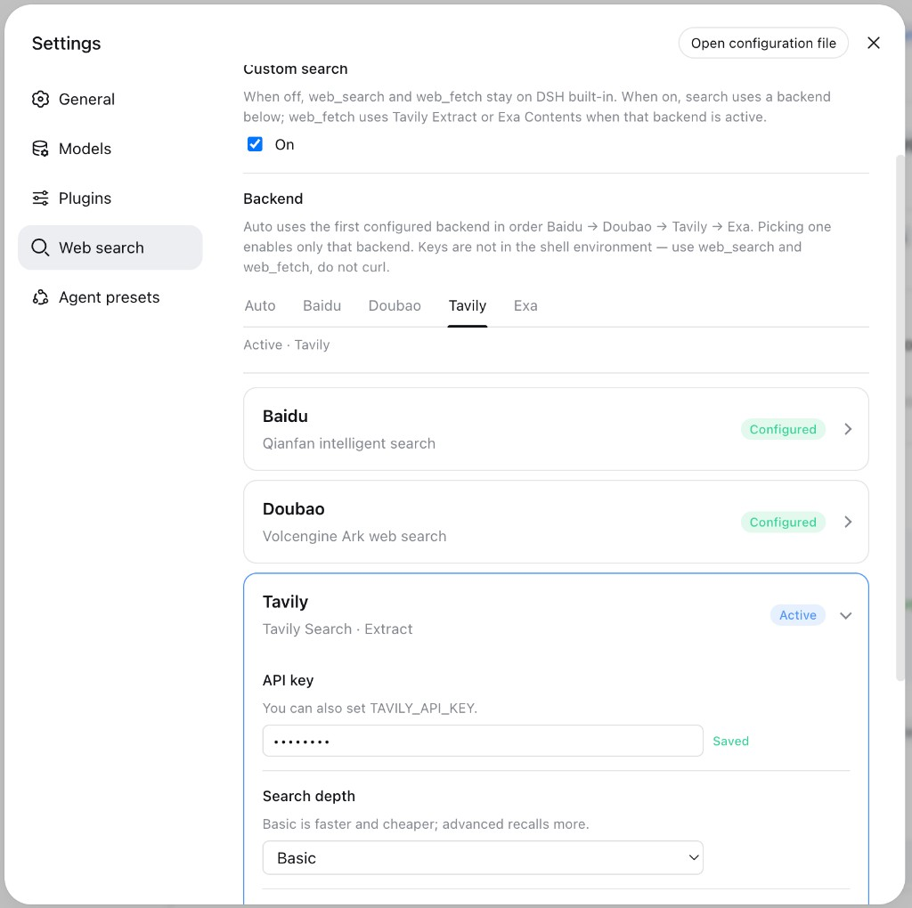

# dsh-web-search

[](https://www.npmjs.com/package/@yugasun/dsh-web-search)

给 [DeepSeek Harness](https://github.com/deepseek-ai/deepseek-harness) 的**多后端网页搜索**。向 `ctx.web` 注册百度、豆包、Tavily、Exa、Serper；模型侧仍使用官方 `web_search` / `web_fetch` 工具。

兼容 DeepSeek Harness **0.1.0-rc.7**。

[English](README.md)

> 安装插件会在 Harness 进程内以你的权限运行第三方代码。安装前请阅读源码。

## 安装

从 npm：

```sh
dsh plugin --profile web add @yugasun/dsh-web-search
```

从本仓库本地路径（相对路径是相对 **profile 目录** 解析的，请用 `$PWD`。`link:` 后插件会从 DSH profile / 安装树解析 `@deepseek-ai/*`，不必先有本仓库的 `node_modules` 才能启动）：

```sh
dsh plugin --profile web add "$PWD/packages/dsh-web-search"
dsh plugin --profile desktop add "$PWD/packages/dsh-web-search"
```

安装后请重启 `dsh web`。设置侧栏会出现 **网络搜索** 页。关闭 **自定义搜索** 则继续用 DSH 内置 `web_search` 和 `web_fetch`；开启后配置百度 / 豆包 / Tavily / Exa / Serper。**网页提取** 与搜索独立：自动跟随 Tavily/Exa 搜索，或固定 Tavily Extract、Exa Contents、DSH `http`。



从 Git 子目录：

```sh
dsh plugin --profile web add github:yugasun/dsh-plugins#path:packages/dsh-web-search
```

卸载：

```sh
dsh plugin --profile web remove @yugasun/dsh-web-search
```

## 后端

| Id | 服务 | 密钥 | 说明 |
| --- | --- | --- | --- |
| `baidu` | 千帆[普通搜索](https://cloud.baidu.com/doc/qianfan-api/s/Wmbq4z7e5) `POST /v2/ai_search/web_search`（默认）或[智能搜索生成](https://cloud.baidu.com/doc/qianfan-api/s/Hmbu8m06u) `POST /v2/ai_search/chat/completions` | `BAIDU_API_KEY` / `QIANFAN_API_KEY` | 默认走**普通搜索**，只返回标题、链接和摘要，更快、不调模型。可在设置里切到 **AI 搜索**；该路径更慢，知识类问题常常只有摘要、没有 `references`，此时会尝试从摘要文本里回收 `https?://` 链接。 |
| `doubao` | [豆包搜索 Custom](https://docs.volcengine.com/docs/87772/2272953?lang=zh) `POST /search_api/web_search`（默认）或 [Global](https://docs.volcengine.com/docs/87772/2548026?lang=zh) `POST /search_api/global_search` | `DOUBAO_API_KEY` / `DOUBAO_SEARCH_API_KEY` | 密钥在[豆包搜索控制台](https://console.volcengine.com/search-infinity/api-key)创建。Custom 更适合中文；Global 面向国际网页。旧的方舟接口地址会自动改走豆包搜索。 |
| `tavily` | Tavily Search `POST /search` 与 Extract `POST /extract` | `TAVILY_API_KEY` | 带摘要和可选 answer。可作为 `web_fetch` 后端。 |
| `exa` | Exa Search `POST /search` 与 Contents `POST /contents` | `EXA_API_KEY` | 搜索**只返回链接，没有 answer**。默认 id 为 `exa`；若同时安装了官方 Exa 包，请改 `exaProviderId`。可作为 `web_fetch` 后端。 |
| `serper` | [Serper](https://serper.dev) Google 搜索 `POST /search` | `SERPER_API_KEY` | 返回网页标题、链接和摘要。有 answer box 或知识图谱描述时作为 `content`。可选 `serperGl` / `serperHl` 指定国家和地区与语言。不能作为 `web_fetch` 后端。 |

密钥可以写在插件设置（`~/.dsh/settings.yaml`）、DSH 凭据（`TAVILY_API_KEY` 等）或 `~/.dsh/.env`。设置里的密钥不会回显到前端。设置页点 **清除** 或清空输入框会从 YAML 里删掉该项。

「设置 → 网络搜索」里的 **自定义搜索** 开关决定走 DSH 内置还是本插件。开启后默认 **自动** 按 百度 → 豆包 → Tavily → Exa → Serper 选用第一个已配置的；请求失败会试下一家，并在 harness 日志里记下跳过了谁，指定某一家则不会。**网页提取** 与搜索独立：自动时，当前搜索是 Tavily / Exa 才走对应提取，否则用内置 `http`；也可以固定 Tavily / Exa / 内置 HTTP。每张卡片有 **测试连接**。Agent 里 `export TAVILY_API_KEY=…` **不会**进入 Harness 进程。

## 开发

```sh
pnpm --filter @yugasun/dsh-web-search test
pnpm --filter @yugasun/dsh-web-search build
```

## 许可证

[MIT](LICENSE)
